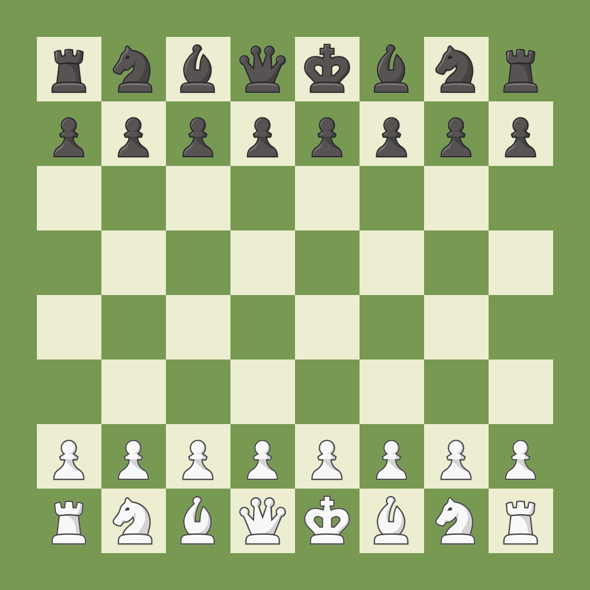

# Ajedrez — Chess App

<div align="center">

</div>

Expo (SDK 54) chess application built on top of `@og-nav/expo-chessboard`. Features three game modes, Stockfish engine integration, i18n (en/es), dark mode, and a comprehensive smoke-test suite for manual QA.

<div align="center">


</div>

## Modes

<div align="center">

| Bot Aleatorio | Stockfish | 1v1 Local |
|---|---|---|
|  |  |  |
| Opponent plays random legal moves. | Play against a real chess engine (WASM via WebView) with adjustable skill level (0–20). | Two players on the same device; board auto-flips after each move. |

</div>

When starting a **Random Bot** or **Stockfish** game, you pick your side (White, Black, or Random). Clicking **New Game** during a bot match opens a color picker modal so you can change sides for the next round.

## Features

- **Mode Selector** — three game modes with color choice (White / Black / Random) for bot games
- **Color Picker Modal** — when pressing "New Game" in bot modes, a modal lets you pick your side before starting a fresh game
- **Stockfish Engine** — real UCI chess engine running as a Web Worker inside a hidden WebView, communicating via the Stockfish protocol; skill level 0–20
- **Random Bot** — picks a random legal move from the current position; lightweight opponent for casual play
- **Undo / Redo** — scrub through move history with full animation and sound
- **Premoves** — queue moves ahead of time while the bot is thinking
- **Sound Effects** — distinct sounds for moves, captures, checks, checkmate, and stalemate (via `expo-audio`)
- **Board Themes** — three color palettes: Blue, Green, Wood
- **Piece Styles** — standard PNG piece images or Unicode chess glyphs
- **Board Size** — responsive Auto mode, 320px compact, or 400px large
- **Animation Speed** — adjustable piece animation duration (150ms–600ms)
- **Auto-Flip** — in 1v1 mode, automatically rotates the board so the active player faces their pieces
- **Coordinates** — toggle rank/file labels (A-H, 1-8) on the board edges
- **Dark Mode** — full light/dark theme support, follows system preference
- **i18n** — English and Spanish translations
- **Haptic Feedback** — soft haptic pulses on tab presses (iOS)

## Settings

The settings screen provides toggles and sliders for every aspect of the experience. Each setting has a **?** help button that explains what it does.

- Language (Español / English)
- Bot Skill Level (0–20)
- Board Theme (Blue / Green / Wood)
- Piece Style (PNG / Unicode)
- Board Size (Auto / 320px / 400px)
- Animation Speed (150ms–600ms)
- Auto-Flip Board (1v1 mode)
- Show Coordinates
- Sound Effects
- Premoves vs CPU

## Smoke Tests

The **Smoke** tab contains **46 self-contained test cards** exercising every public prop, every imperative ref method, both controlled and uncontrolled modes, every theme, premoves, history scrubbing, all special chess moves (castling, en passant, promotion), sounds, highlights, arrows, custom piece rendering, and regression blocks. Each card has a Reset button and describes exactly what to do and what to expect.

## Setup

```bash
pnpm install
pnpm start #dev mode
```

## Structure

```
app/
  _layout.tsx                        # Root layout (GestureHandler, Theme, I18n, Settings providers)
  (tabs)/
    _layout.tsx                      # Native bottom tabs (Play, Smoke, Settings)
    play/
      index.tsx                      # Mode selector + game session (random/stockfish/1v1)
    smoke/
      index.tsx                      # 46 self-contained smoke-test cards
    settings/
      index.tsx                      # Full settings screen with toggles, sliders, help modals
assets/
  images/
    play.svg                         # Pawn icon (Random Bot)
    cpu.svg                          # Robot icon (Stockfish)
    friend.svg                       # Handshake icon (1v1 Local)
  stockfish_js.txt                   # Stockfish engine JS (Web Worker entry)
  stockfish.wasm                     # Stockfish WASM binary
lib/
  stockfish-engine.ts                # useStockfish hook — UCI protocol, skill level, FEN-based move requests
  stockfish-webview.tsx               # Hidden WebView component running Stockfish as a Web Worker
  random-bot.ts                      # pickRandomMove — picks a random legal move
  i18n.tsx                           # I18nProvider + useI18n hook (en/es)
  settings.tsx                       # SettingsProvider + useSettings hook
components/
  ui/mode-icons.tsx                  # SVG icons (Pawn, Robot, Handshake)
  body-scroll-view.tsx               # ScrollView preset for large-title + tab bar insets
  smoke-card.tsx                     # Reusable smoke-test card with Chessboard + controls
  haptic-tab.tsx                     # Tab bar button with haptic feedback
constants/
  theme.ts                           # Light/dark color definitions and fonts
```

## Tech Stack

| Dependency | Version |
|---|---|
| Expo SDK | 54 |
| React Native | 0.81 |
| expo-router | 6 |
| react-native-reanimated | 4 |
| react-native-gesture-handler | 2 |
| chess.ts | 0.16 |
| Stockfish | WASM (niklasf/stockfish.js) |
| expo-audio | 1 |
| expo-haptics | 15 |
| react-native-webview | 13 |
| react-native-svg | 15 |

---

*Proyecto adaptado del template original de `@og-nav/expo-chessboard/example`.*
